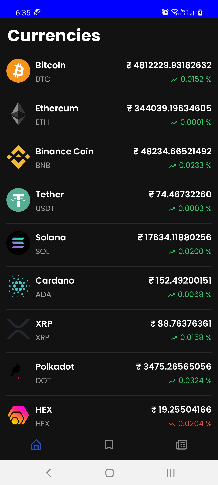
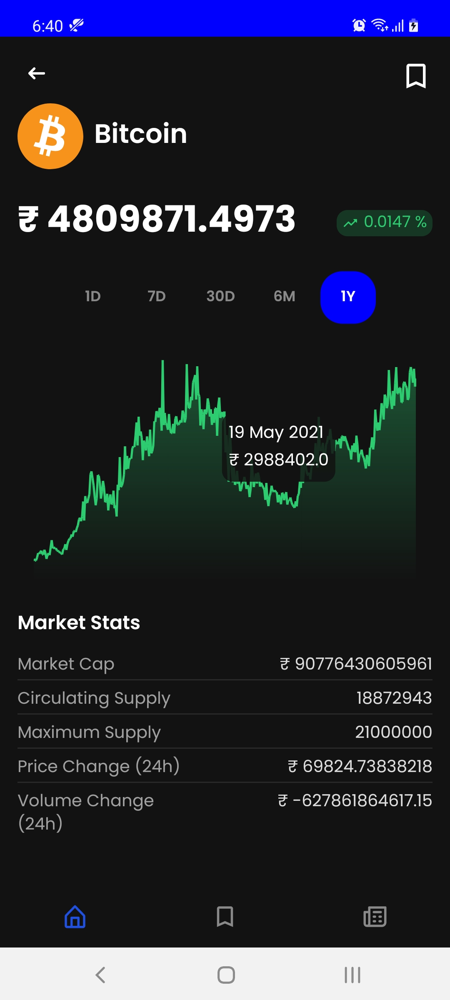
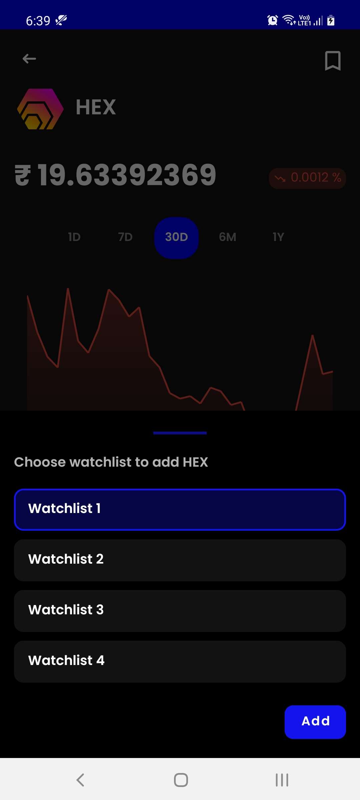
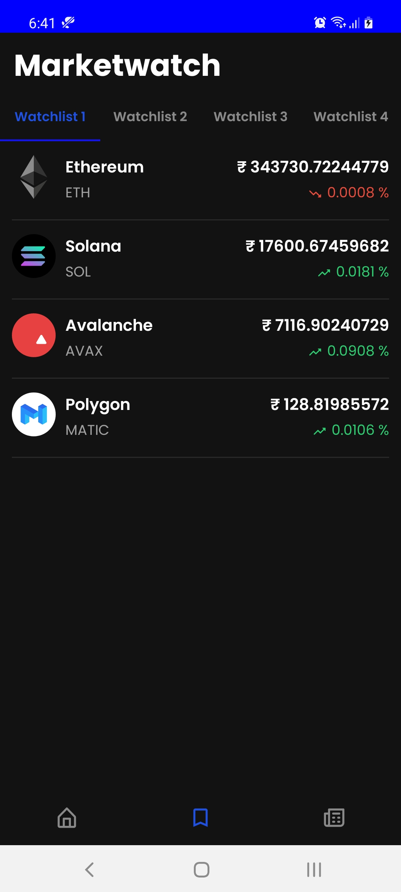

 
  

 

## Features
- CryptoWatch helps you track prices of over 1000 cryptocurrencies.
- Get latest news in cryptocurrency space and view the full article without leaving the application.
- Evaluate historical prices of currency for 1 day, 7 days, 30 days, 6 months and 1 year using line chart.
- Get the market cap, circulating supply, max supply, price change and volume change within 24hours of all currencies.
- Currencies can be added to four different watchlists to keep track of invested or interested currencies quickly.

## Screenshots
 

   <table align="center" border="0" >
  <tr>
    <td>
       <td></td>
     <td> </td>
  </table>
  

 

  <table align="center" border="0" >
  <tr>
    <td> </td>
     <td> </td>
     <td> </td>
  </tr>
</table>
  

 

## Credits
- [Nomics API](https://p.nomics.com/cryptocurrency-bitcoin-api) is used to get all currencies.
- [CryptoCompare API](https://min-api.cryptocompare.com/) is used to get historical data of currencies and news.
