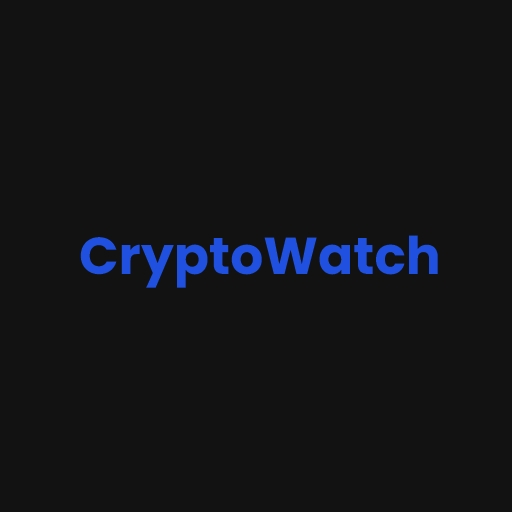

 
  

 

## Features
- CryptoWatch helps you track prices of over 1000 cryptocurrencies.
- Get latest news in cryptocurrency space and view the full article without leaving the application.
- Evaluate historical prices of currency for 1 day, 7 days, 30 days, 6 months and 1 year using line chart.
- Get the market cap, circulating supply, max supply, price change and volume change within 24hours of all currencies.
- Currencies can be added to four different watchlists to keep track of invested or interested currencies quickly.

## Screenshots
 
  
|   Home   |   Currency Details    |   Add to watchlist  
|---	|---	|---
|      |      |       

|   Watchlists   |  News   |   Full article inside app 
|---	|---	|---
|      |      |     

 

## Built With
- [Kotlin](https://kotlinlang.org/) - First class and official programming language for Android development.
- [Coroutines](https://kotlinlang.org/docs/reference/coroutines-overview.html) - For asynchronous and more.
- [LiveData](https://developer.android.com/topic/libraries/architecture/livedata) - Data objects that notify views when the underlying database changes.
- [ViewModel](https://developer.android.com/topic/libraries/architecture/viewmodel) - Stores UI-related data that isn't destroyed on UI changes.
- [ViewBinding](https://developer.android.com/topic/libraries/view-binding) - Generates a binding class for each XML layout file present in that module and allows you to more easily write code that interacts with views.
- [Navigation](https://developer.android.com/guide/navigation/navigation-getting-started) - Navigation is a framework for navigating between ‘destinations’ within an Android application
- [Room](https://developer.android.com/jetpack/androidx/releases/room) - The Room persistence library provides an abstraction layer over SQLite to allow for more robust database access while harnessing the full power of SQLite. 
- [Retrofit](https://square.github.io/retrofit/) - A type-safe HTTP client for Android and Java.
- [Moshi](https://github.com/square/moshi) - A modern JSON library for Kotlin and Java.
- [Moshi Converter](https://github.com/square/retrofit/tree/master/retrofit-converters/moshi) - A Converter which uses Moshi for serialization to and from JSON.
- [MPAndroidChart](https://github.com/PhilJay/MPAndroidChart) - A powerful & easy to use chart library for Android
- [Glide](https://github.com/bumptech/glide) - Glide is a fast and efficient open source media management and image loading framework for Android
- [Material Components for Android](https://github.com/material-components/material-components-android) - Modular and customizable Material Design UI components for Android

## Credits
- [Nomics API](https://p.nomics.com/cryptocurrency-bitcoin-api) is used to get all currencies.
- [CryptoCompare API](https://min-api.cryptocompare.com/) is used to get historical data of currencies and news.
